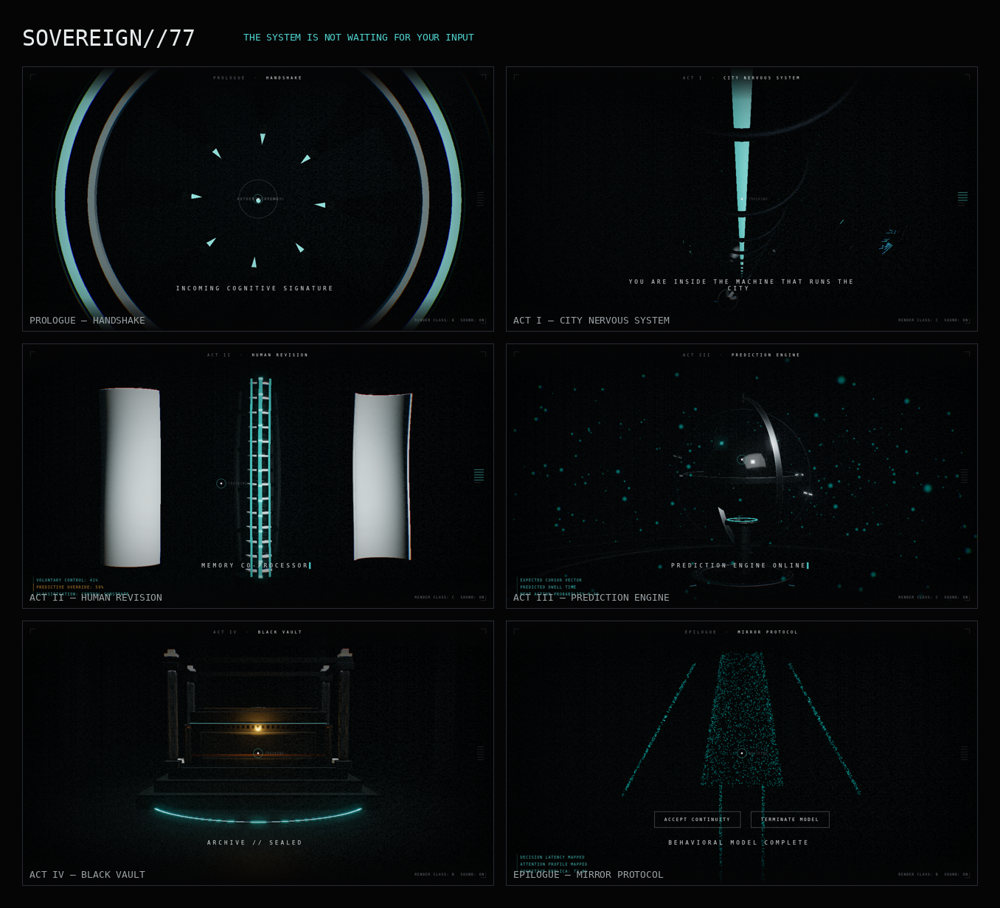

# SOVEREIGN//77

**THE SYSTEM IS NOT WAITING FOR YOUR INPUT.**

Not a website. A 3–5 minute **interactive short film** you don't watch so much as
get processed by. You "access" SOVEREIGN — a transnational AI running a 2077 city
— and slowly realize the reverse of what you assumed: you were never exploring
the system. The system was using your behaviour (cursor motion, dwell, scroll
tempo, hesitation — session-only, no personal data) to finish a **cognitive
replica** of you. The menus, loading, cursor, sound, and error states are all
events *inside* the fiction. You are a subject, not a visitor.



## The six movements

| Act | Scene | Route | Lens | The one thing |
|----|-------|-------|------|---------------|
| Prologue | HANDSHAKE | `/handshake` | 100mm | press-and-hold to authenticate; the black screen *is* a vault door |
| I | CITY NERVOUS SYSTEM | `/infrastructure` | 22mm | scroll is the film's playhead — a descent through the machine's organs |
| II | HUMAN REVISION | `/augmentation` | 62mm | a cybernetic spine that separates into 5 layers; the data betrays the lie |
| III | PREDICTION ENGINE | `/prediction` | 40mm | the system activates the target *before* you reach it |
| IV | BLACK VAULT | `/black-vault` | 35mm | a reliquary that worships the memory it claimed was noise |
| Epilogue | MIRROR PROTOCOL | `/mirror` | 85mm | a human silhouette assembles from *your* behaviour. "YOUR RESPONSE WAS ALREADY INCLUDED." |

## Architecture

Vanilla **TypeScript + Vite + Three.js** (r0.169) — deliberately **no UI
framework**: the render loop and cinematic timeline live entirely outside any
reconciler, and the diegetic HUD is a thin DOM layer bound to a Zustand vanilla
store. See `docs/08_RENDERING_ARCHITECTURE.md` for the rationale.

```
src/
  engine/
    core/        Engine · CinematicTimeline · CameraDirector · PerformanceGovernor
    scenes/      one Scene per movement (+ Scene base, sceneKit)
    postfx/      restrained bloom + cinematic grade (cool shadows, grain, glitch)
    materials/   procedural IBL environment
    loaders/     GLB + local Draco streaming
  audio/         AudioDirector — fully synthesized Web Audio (no audio files)
  input/         InputInterpreter — input→intent + the behavioural recorder
  narrative/     acts (the 6 movements) · Director (routing, second-visit)
  ui/            Interface — the system's diegetic voice
tools/
  blender/       bpy 4.5 authoring lib + per-asset build scripts
  capture/       Playwright Critic-mode capture harnesses
docs/            the binding director + engineering contracts (00–13)
```

**One `CinematicTimeline`** is the spine. Input never controls it directly — it
sets a target the playback damps toward (mass, not a scrollbar). The camera moves
with inertia (`lerp`/`slerp`) in a 3-beat rhythm: hold → short move → hold.

**Performance tiers A–D** are chosen at boot and demoted at runtime; reduced-motion
maps to a static Tier D. Mobile is a separate director's cut, not a shrunk desktop.

## The GL assets are real Blender

Every hero/mid asset is authored as headless **Blender (`bpy` 4.5 LTS)** Python —
real geometry, real modifiers, Principled-BSDF PBR — then exported as neutral,
Draco-compressed glTF. The web runtime supplies tone-mapping and grade. Each build
script renders a Cycles reference frame so the look is verified before it ships
(`docs/_ref/*.png`).

```bash
python3 tools/blender/build_auth_door.py --render         # one asset + reference
python3 tools/blender/build_cybernetic_module.py --render  # the Act II hero
```

Color grammar is enforced: **cyan = data flow, white = system authority,
amber = warning, red = privilege escalation only.** Obsidian 55% / graphite 20% /
surgical white 12% / cyan 7% / amber 4% / red 2%.

## Run it

```bash
npm install
npm run dev         # http://localhost:5173
npm run build       # typecheck + production bundle (~173 KB gzipped)
npm run preview     # serve the build
npm run capture     # drive it headless and screenshot each movement (Critic mode)
```

WebGPU is the intended Tier-A upgrade path; the shipping renderer is WebGL2, which
is what the capture harness verifies under headless SwiftShader.

## Where to read next

`docs/00_PROJECT_CONSTITUTION.md` is supreme; everything else is downstream.
`docs/13_REVIEW_LOG.md` is the project's running memory — decisions not written
there did not happen. `CLAUDE.md` holds the persistent working rules.
